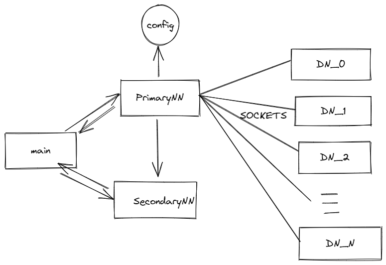
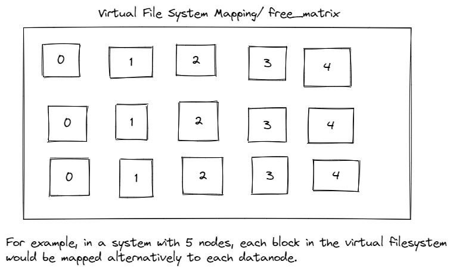

# YetAnotherHadoop
Final project for Course UE19CS322

## Credits
- Kunal Bhat PES1UG19CS237
- Utkarsh Gupta PES1UG19CS549
- Likith B PES1UG19CS244
- Varun MK PES1UG19CS558

## Usage
### Create new HDFS
```
python3 main.py
```
### Run HDFS from config
```
python3 main.py --config <config_path>
```
### Run MapReduce function
```
python3 main.py --mapper <mapper.py> --reducer <reducer.py> --input <path_to_input_in_HDFS> --output <path_to_output_in_HDFS>
```
### Using the Command Line Interface
The following CLI commands are provided for the user to interact with the file system. 

- `put <local src> <HDFS dest>` (move a file into HDFS)
- `mkdir <folder>` (create a new directory)
- `cat <HDFS src>` (output a file)
- `ls` (list HDFS contents) 
- `rmdir <src>` (remove an empty directory)
- `rm <src>` (remove a file)
- `mr <hdfs input path> <mapper path> <reducer path> <hdfs output path>` (for map reduce)
- `format` (format the namenode and restart it)
- `exit` (stop the HDFS)

## Report

The following is the report regarding the project "Yet Another Hadoop" of YAH for the Course UE19CS322-Big Data, 5th Semester, 2021. 

The goal of this project is to create a mini HDFS resembling that of Hadoop consisting of the core components, namely, namenodes, datanodes and the replication of blocks across datanodes. Additionally, the system created must also be capable of performing map-reduce functions for computationally heavy tasks using the blocks stored on the system and mostly tolerant to failures. 

The system is first created using the config file provided by the user. The configuration file contains all the specifications required for the HDFS about to be created - Size of the block, path to the datanodes, namenodes, replication factor, number of datanodes, the sync period, log paths, the checkpoints and the path to the virtual file system containing the structure of the system.

The program is heavily multithreaded. The command line interface is provided by the main thread, which is also responsible for starting and communicating with the Primary and Secondary namenodes, both of which run as their own threads. Each of these namenodes contains two threads, one for the primary functionality, including receiving HDFS queries, and another thread which handles timing related functions such as heartbeats and respawning of processes. They communicate with the main thread using IPC. There are three queues in the program, the pnnQueue, the snnQueue and the mainQueue which are used to send messages to the primary name node, secondary namenode and the main thread respectively. There’s a predefined set of communication codes that are used to identify signals.

The secondary namenode is in charge of ensuring the primary namenode is always running. In case of failure, it takes over the job of the primary namenode and spawns a new secondary name node process.



When the primary namenode is initialized, it also initializes all the required datanodes, by essentially also creating a process for each datanode and assigning a port number to each datanode. It keeps track of the datanode processes and ensures the processes are restarted in case of crashes. Communication gets slightly more advanced here as we wanted to build the program to work across machines and not just locally. Sockets have been used in order to communicate between datanodes and namenodes. The file system itself along with paths is stored in the namenode in the form of a graph. Each folder is seen as a nested dictionary which can be traversed using graph traversal algorithms.There are recursive functions implemented in order to create directories, delete directories, put files, list files and remove files. Each file is seen as a set of blocks where they’re stored. The blocks are mapped in the free_matrix and each block has a value of true or false depending on where it belongs.



Before loading files into the DFS, we check if there's enough available space including the replication factor. We read parts of the files in the forms of packets the size of the block and send it across. Each of these blocks is stored in the form of files in the datanode folders. 

The datanode server is continuously listening for data and stores blocks as it receives them in its respective folder. The logic to write and remove files to and from the DFS are within the namenode for simplicity.

For map-reduce jobs, data from input file blocks are read into a temporary file using the internal cat function. From here, mapper and reducer programs read the input as they would from stdin. The mapper output is stored in a temporary sorted file. The final output is stored in the specified output file. 

